# How YouTube Knows Exactly What You Want to Watch Next

You open YouTube. You haven't searched for anything. You haven't told it your mood.
And yet... the homepage just *gets* it.

How?

It's not magic. It's a beautifully engineered machine. And once you understand it, you'll never look at your feed the same way again.

Let's break it down from scratch.

## First, understand the scale of the problem

YouTube has more than **800 million videos**. You're one user. You open the app and within **200 milliseconds** (that's 0.2 seconds faster than a blink), it has to decide which 30 videos to show you.

You can't look at all 800 million videos and pick the best ones in 200ms ( < 1s). That's physically impossible.

So what do you do?

---

## The Big Idea: The 3-Stage Pipeline

Think of it like hiring for a job.

- You don't interview every human on earth (800M videos)
- You filter resumes first (retrieval)
- Then interview the shortlist (ranking)
- Then decide whom to hire (re-ranking)

That's exactly what's happening under the hood.

```mermaid
flowchart TD
    A[👤 User Opens App] --> B[API Gateway]
    B --> C[Feature Server
    fetch user context + history]
    C --> D[🔍 RETRIEVAL STAGE Millions → 500K 
    ANN Vector Search]
    D --> E[⚡ PRE-FILTER
    Heuristics
    500K → 10-20K]
    E --> F[🧠 RANKING STAGE
    Deep DNN on GPU
    20K → 1K
    Predicts: Watch Time, CTR, Satisfaction]
    F --> G[🎯 RE-RANKING
    Business Rules
    1K → 30
    Diversity + Policy + Freshness]
    G --> H[📱 Homepage Feed
    30 Personalized Videos]

    subgraph OFFLINE [Offline Pipeline - runs in background]
        I[User Events
        clicks, watches, likes, skips ... ] --> J[Event Logger
        Kafka Stream]
        J --> K[Data Warehouse
        Spark / BigQuery]
        K --> L[Model Training
        Two-Tower + Ranking DNN]
        L --> M[Model Registry]
        M --> N[ANN Index Rebuild
        nightly - FAISS / ScaNN]
    end

    subgraph STORAGE [Storage Layer]
        O[Feature Store
        Redis - cached features]
        P[Vector DB
        precomputed embeddings]
    end

    C -.->|reads from| O
    D -.->|queries| P
    N -.->|updates| P
```




## Stage 1: Retrieval - "Find candidates fast"

Okay so here's a question. How do you represent a *user's taste* as something a computer can search?

You turn it into a **vector** - basically a list of numbers.

```
User X's taste vector: [0.8, 0.1, 0.95, 0.3, 0.7, ...]
                            (tech) (cooking) (ML) (sports) (comedy)
```

And every video also has a vector:

```
Video 1: "Intro to Neural Networks": [0.9, 0.0, 0.98, 0.1, 0.2, ...]
```

If these two vectors are **close to each other** in space, the video is probably something X would like.

This is called an **embedding**, and the model that generates these embeddings for users AND videos is called the **Two-Tower Network**.

### What is Two-Tower, really?

It's just two neural networks trained together:

- **User Tower** → takes in (demographics, watch history, session data) → outputs a 256-dimensional user vector
- **Video Tower** → takes in (title, category, description, engagement stats) → outputs a 256-dimensional video vector

They're trained so that videos a user *actually watched* end up close to that user's vector. Simple idea, powerful result.

> 🔑 **Key thing to understand:** The Two-Tower model runs **offline**. By the time you open the app, your embedding and all video embeddings are **already computed and sitting in a database**. Nothing gets trained at request time.

### So what happens at request time?

1. Grab your pre-computed user embedding from cache (Redis)
2. Run **ANN search** (Approximate Nearest Neighbor) in a Vector DB like FAISS or ScaNN
3. Get back **~500K video IDs** whose embeddings are closest to yours

This takes about **10ms**. Why so fast? Because ANN search doesn't compare your vector to every single video - it uses smart indexing (like HNSW - Hierarchical Navigable Small Worlds) to find approximate nearest neighbors very efficiently.

You lose a tiny bit of accuracy. You gain enormous speed. Worth it.


## Stage 2: Ranking - "Score the shortlist properly"

Okay so you have 500K videos. Still too many. You need the best 1K.

But here's the thing - ANN retrieval only knows "similar embeddings = good match." It doesn't know:

- Will this user actually *click* on it?
- Will they watch 80% of it or close it in 5 seconds?
- Did they just watch something exactly like this 2 minutes ago?

For that, you need the **Ranking Model**.

### How it works

First, you pre-filter from 500K to ~10-20K using fast heuristics (simple rules or a lightweight GBDT model - think: remove videos from blocked creators, remove duplicates, remove already-watched).

Then for each of the remaining 10-20K videos, you assemble:

```
Input = User features + Video features + Context features

User features:    age, country, watch history, session length
Video features:   category, duration, upload date, avg watch time
Context features: time of day, device type, current session context
```

You feed all of this into a **Deep Neural Network** that predicts 3 things simultaneously:

| Prediction | What it means |
|---|---|
| Click probability | Will the user tap on this? |
| Watch time | If they click, how long will they watch? |
| Satisfaction score | Will they like/share/save it? |

These 3 scores are combined into one final score using a weighted formula:

```
final_score = (watch_time × 0.5) + (click_prob × 0.3) + (satisfaction × 0.2)
```

Weights are tuned based on what the business cares about most (watch time is YouTube's north star).

Sort all videos by final_score → keep top 1K.

### Why is this fast enough?

Three reasons:

1. You're only scoring 10-20K videos, not 500K (pre-filter saved you)
2. GPU batch inference - all 10K videos are scored **in parallel** in one forward pass, not one by one
3. User features are pre-cached in Redis - no slow database calls

> 💡 Think of it like this: scoring 10K items on a GPU is roughly the same wall-clock time as scoring 100. That's the whole superpower of batch GPU inference.

---

## Stage 3: Re-ranking - "Apply common sense"

Your ML model is smart, but it doesn't know about business rules. That's what re-ranking is for.

No ML here - just logic:

- **Diversity:** Max 2 videos from the same creator. Max 3 from the same category. You don't want 30 cooking videos.
- **Freshness boost:** Hard-inject some new/trending content even if the model didn't rank it highly. Helps new creators get surface area.
- **Policy filters:** Remove anything that violates content guidelines, geo-restrictions, age restrictions.
- **Dedup:** Don't show videos the user watched in the last 7 days.

Result: **30 clean, diverse, personalized videos**. Sent to your screen.

---

## The Offline Training Pipeline (The Engine Behind It All)

Everything above is the *serving* path - what happens when you open the app.

But how do the models get good in the first place?

Every time you interact with a video - click, watch, skip, like, share - that event is logged. Millions of users generate billions of these events every day.

This stream of events flows into a data warehouse (Spark + BigQuery or similar). From there:

1. **Labels are created** - videos you watched >50% = positive label, shown but not clicked = negative label
2. **Features are joined** - user features + video features at the time of impression
3. **Models are retrained** - Two-Tower (retrieval) retrained weekly, Ranking DNN retrained daily
4. **ANN index is rebuilt** - every night with fresh video embeddings
5. **Models deployed** via Model Registry → serving fleet picks it up

---

## Cold Start: What about new users and new videos?

This is the classic nightmare scenario.

**New user?**
- No history = no personalization
- Show trending content for their region/language
- Use onboarding survey ("what topics do you like?")
- After first 5 watches, you have enough signal to personalize

**New video?**
- No engagement data yet = Two-Tower doesn't know how to embed it well
- Use content-based features only: title embedding, category, description
- After enough views come in, collaborative signals kick in
- Also: inject new videos via freshness boost in re-ranking so they get initial exposure

---

## Does Instagram/TikTok work the same way?

Yes. Almost identical architecture.

The differences are small:

| | YouTube | Instagram/TikTok |
|---|---|---|
| Item type | Long-form video | Short posts, reels |
| North star metric | Watch time | Shares, saves, replays |
| Content corpus | 800M videos | Billions of posts |
| Session behavior | Intentional search + browse | Pure infinite scroll |

The pattern - Two-Tower retrieval → Deep ranking → Rule-based re-ranking - is the **industry standard**. Netflix, Spotify, Twitter, LinkedIn all use some version of this.

---

## Putting it all together

If someone asks you "how does YouTube recommendation work?" - here's your 30-second answer:

> *"It's a 3-stage funnel. First, a Two-Tower model generates embeddings for users and videos offline. At request time, ANN search retrieves ~500K similar videos in ~10ms. Then a Deep Ranking DNN scores each candidate on predicted watch time, click probability, and satisfaction - runs on GPU, takes ~50ms. Finally, rule-based re-ranking enforces diversity, freshness, and policy filters to get to the final 30. The whole thing runs in under 200ms."*

That's it. That's the system.

---

## Quick Reference Cheat Sheet

```
RETRIEVAL
  Input:  User embedding (cached)
  Method: ANN search (FAISS/ScaNN/HNSW)
  Output: 500K candidate video IDs
  Time:   ~10ms

RANKING
  Input:  500K → pre-filter → 10-20K (user + video + context features)
  Method: Deep DNN, GPU batch inference
  Output: Top 1K by combined score
  Time:   ~50ms

RE-RANKING
  Input:  Top 1K
  Method: Rules (diversity, policy, freshness, dedup)
  Output: Final 30
  Time:   ~5ms

TOTAL:  ~150-200ms ✅
```

---

*Understanding this architecture is the foundation for designing any modern recommendation system - search ranking, ads, social feeds, e-commerce. The funnel pattern scales to any domain. Master this, and you've got 80% of it.*